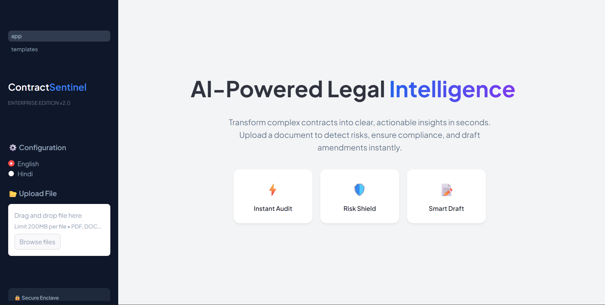
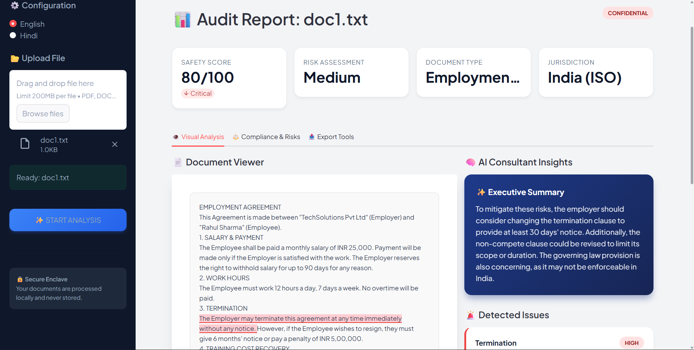
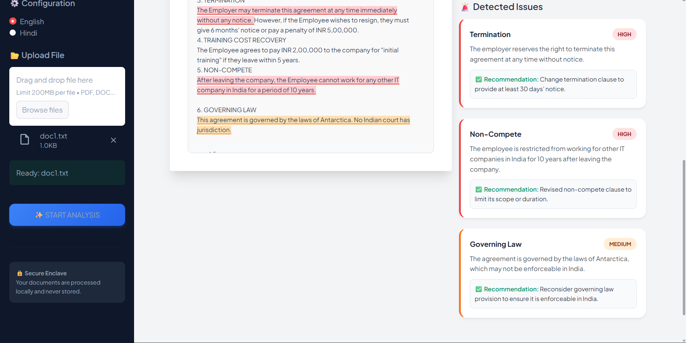
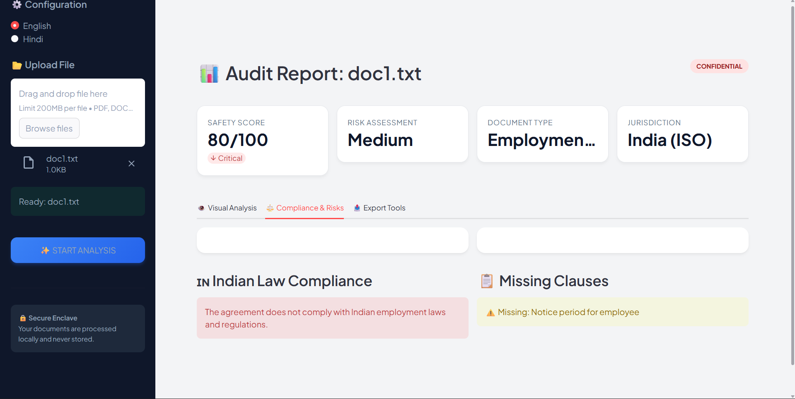
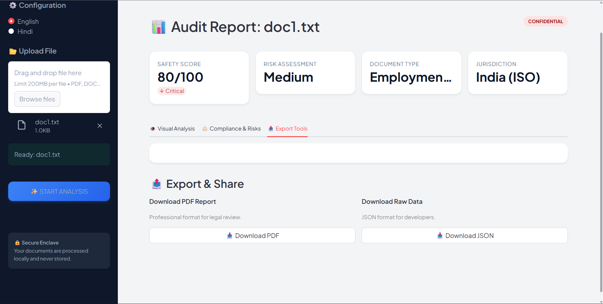
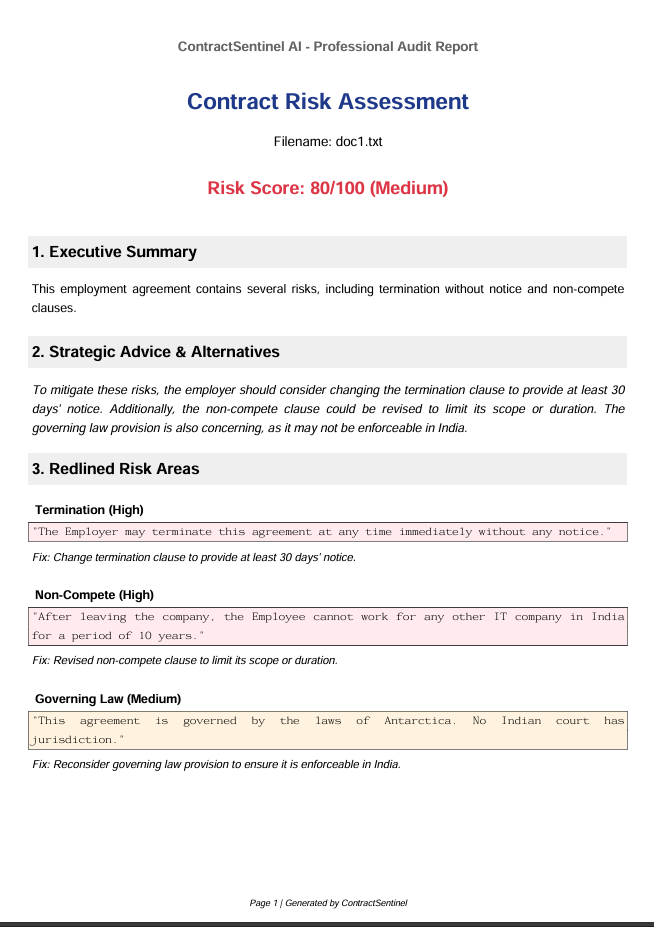

# -Contract-Analysis-Risk-Assessment-Bot-
ContractSentinel is an AI-powered legal audit platform that helps Indian SMEs instantly detect contract risks, ensure compliance with ICA 1872, and draft secure legal agreements in seconds.

# ⚖️ ContractSentinel AI (Enterprise Edition)

> **AI-Powered Legal Risk Assessment & Compliance Audit for Indian SMEs.**

ContractSentinel is an intelligent legal assistant that automates the review of legal contracts. It uses Large Language Models (LLM) to detect risks, identify missing clauses, and ensure compliance with the **Indian Contract Act (1872)**.

---

## 📸 Dashboard Preview

--

## 🚀 Key Features

### 1. 🛡️ Smart Risk Analysis
-   **Visual Highlighting:** Automatically highlights risky clauses in **Red (High)** or **Orange (Medium)** directly on the document text.
-   **Scoring Engine:** Generates a "Safety Score" (0-100) based on risk density and severity.

### 2. 🇮🇳 Localized Compliance
-   Specifically trained/prompted to check compliance against **Indian Laws** (ICA 1872, IT Act).
-   Identifies jurisdiction issues (e.g., if a contract cites foreign laws for an Indian entity).

### 3. 🧠 Strategic Recommendations
-   Doesn't just find problems; suggests specific **legal fixes** and amendments.
-   Provides an "Executive Summary" for non-legal stakeholders.

### 4. 📝 Template Studio & Export
-   **AI Drafter:** Generates new contracts (NDAs, Lease Deeds, Employment Agreements) based on simple user inputs.
-   **Professional Reports:** Exports a detailed audit report in **PDF** format.

---

## 🛠️ Tech Stack

| Component | Technology Used |
| :--- | :--- |
| **Frontend UI** | Streamlit (Python) with Custom CSS/HTML Injection |
| **LLM Engine** | Llama 3 (via Ollama) OR Google Gemini 1.5 Flash |
| **Document Processing** | PyPDF2, pdfplumber, python-docx |
| **Visualization** | Custom HTML/CSS for "Paper View" |
| **Report Generation** | FPDF |

---

## ⚙️ Installation & Setup

### Prerequisites
1.  **Python 3.8+** installed.
2.  **Ollama** installed (if running locally).

### 1. Clone the Repository
git clone [https://github.com/yourusername/contract-sentinel.git](https://github.com/yourusername/contract-sentinel.git)
cd contract-sentinel

### 2. Create Virtual Environment

python -m venv venv
# Windows
venv\Scripts\activate
# Mac/Linux
source venv/bin/activate

3. Install Dependencies
pip install -r requirements.txt

4. Setup AI Engine
Option A: Local (Privacy Focused)
Download Ollama.
Run the model: ollama run llama3

▶️ Usage
Run the application: streamlit run app.py
Open your browser to http://localhost:8501.
Upload a PDF or DOCX contract.
Click "Start Audit".
View the Visual Analysis and download the PDF Report.

